# Wooden Home Decor e-store Design Documentation

## Team Information
* Team name: Phoenixes
* Team members
  * Mohammad Hadi Elabed
  * Khaled Al Dasouki
  * Aya Alqawasmi
  * Hrishikesh Kumar
  * Maksim Rashchupkin

## Executive Summary

Our project is a Wooden Home Decor store, which is designed for our Client who is an experienced Wood Artisan. The store will allow customers to buy the products our client produces.

### Purpose
The Wooden Home Decor e-store project will be a website that allows the owner to create and manage an inventory of wooden home decorations crafted by a skilled Japanese carpenter.Customers can browse the available products and manage their cart to decide what items they would like to purchase.

### Glossary and Acronyms

| Term | Definition |
|------|------------|
| SPA | Single Page |
| WHD | Wooden Home Decor |
| DAO | Data Access Object |

## Requirements
This section describes the features of the application.

### Definition of MVP
The MVP will consist of accounts (for customers and an owner) that manage an inventory system which stores products. Customers can browse products and add them to shopping carts, which can then be used to checkout and purchase the products.

### MVP Features
- Account and Login System
- Product Browsing,Searching and Viewing 
- Inventory Management
- Shopping Cart System
- Checking Out and Creating Orders
- Data Persistance

### Roadmap of Enhancements
1. View, Track and Manage Orders 
2. Location Addresses associated with an account
3. Account password
4. Wishlist system

## Application Domain
This section describes the application domain.

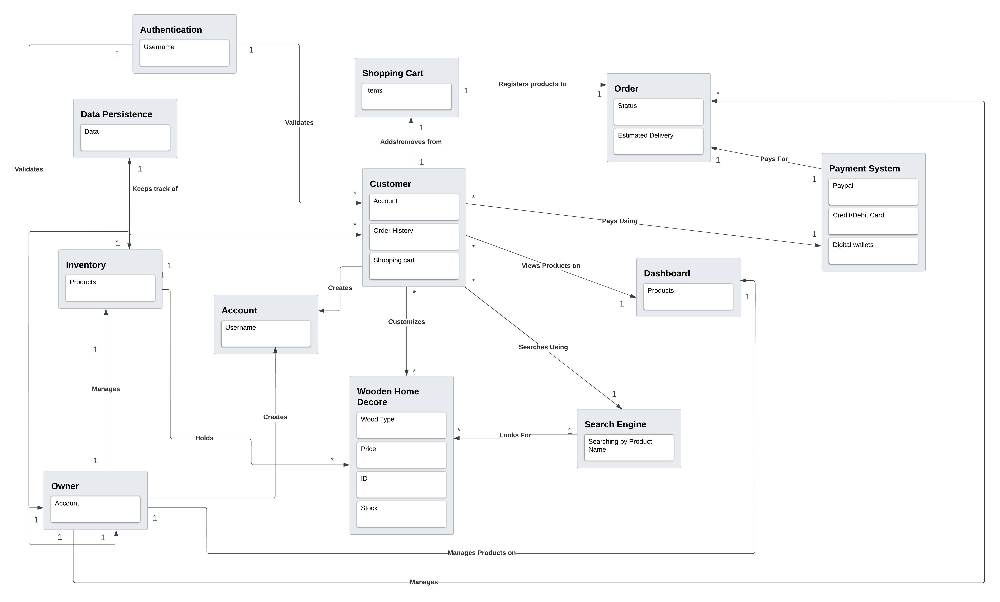

The estore will have accounts that represent the customers and the owner. Customers are able to browse products (the WHD) and add them to a cart while the owner is able to manage the inventory and products.

## Architecture and Design

This section describes the application architecture.

### Summary
The following Tiers/Layers model shows a high-level view of the webapp's architecture.

The e-store web application, is built using the Model–View–ViewModel (MVVM) architecture pattern. 

The Model stores the application data objects including any functionality to provide persistance. 

The View is the client-side SPA built with Angular utilizing HTML, CSS and TypeScript. The ViewModel provides RESTful APIs to the client (View) as well as any logic required to manipulate the data objects from the Model.

Both the ViewModel and Model are built using Java and Spring Framework. Details of the components within these tiers are supplied below.

### Overview of User Interface

The system describes the applications user interface.

### View Tier
Users will be required to login before entering the website dashboard, which shows a list of top products, a search bar to search for products by name, and the navigation buttons. The user can navigate to the products page, sending a GET request, to see a list of all products, the owner/admin of the website will also be able to delete or add products from this page by sending DELETE or POST requests respectively.

When a user clicks on a product, they send a GET request and go to the product details page, where they can see the details of the product they want. Admins will be able to send PUT requests in order to update the products using input boxes.

The following sequence diagram shows the process of a user adding an item to cart

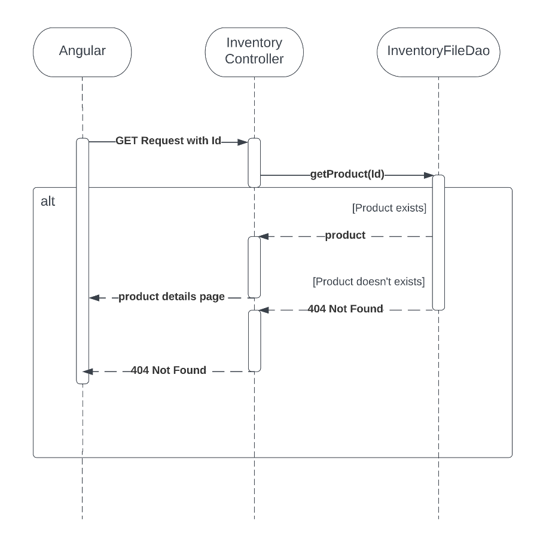

Users can navigate to their shopping cart where they will have a list of all the products inside their cart, which they can remove from. Once a customer is satisfied with their cart they can press the checkout button which takes them to the checkout screen, which includes a list of the products they're going to purchase, and buttons to select the payment method. The customer then chooses whether or not the order is a gift for someone, writes the delivery address and finally creates the order.

### ViewModel Tier
When users send HTTP requests, the controller layer acts accordingly and calls the DAO files which are reponsible for communicating with the persistance layer, updating the JSON files or grabbing the information the user wanted (ex. a single product's details).

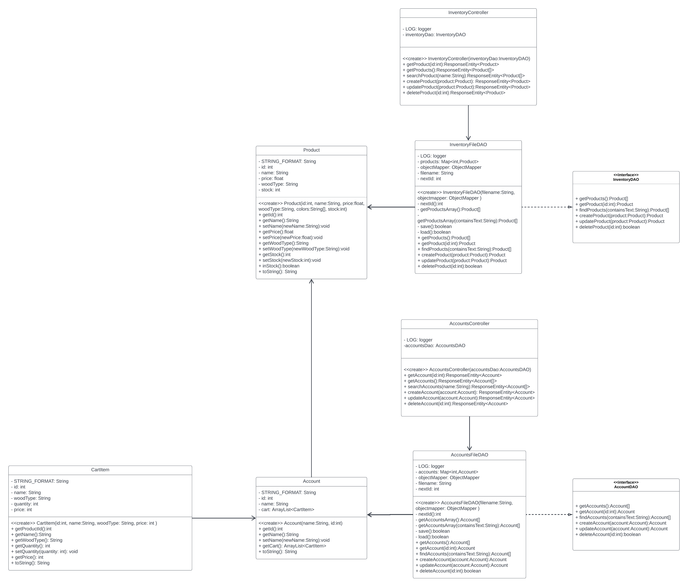

### Model Tier
Users create and use Accounts to access the website and keep their data persistant across sessions, all operations related to the accounts are done through the AccountsFileDao. Accounts now have carts as an ArrayList of CartItems, which take a name and id of a product, but track the selected woodtype, quanitity, and total price (quantitity x individual price)

Products each have their own properties that are stored in the Inventory JSON file, which is accessed by the InventoryFileDao whenever a user would like to get the details of a product for example, or if an owner would like to manage the inventory.

### Static Code Analysis/Design Improvements

Our Design applies many of the OO Design Principles:
1. Single Responsibility: All our classes have one sole purpose.
2. Low Coupling: Our design draws only the necassary relationships between different classes and keeps the design as simple as possible.
3. Information Expert: Classes each have methods that deal with their information rather than relying on a different class to gather/manipulate that information.
4. Depencency Inversion: Java classes are injected in the appropriate place. Typescript services are also injected in the UI part.
5. Controller: Our system uses 2 controllers to manage coordinate actions dealing with accounts and products in the backend.
6. Law of Demeter: methods and attributes are only accessable to the classes that need them in both Java and Typescript parts of the application.
7. Pure Fabrication: FileDAO's are repsonsible for getting information as well as updating it, maintaining and supporting the Single Responsiblity and Low Coupling principles.

An important feature that we should implement if the project is to continue would be security, as for this project we are only requiring a username to login, meaning that there is no password to protect users from entering each others accounts. We could also further improve the data persistance for certain situations, for example currently the stock of a product is reduced when it's added to cart, when it should be deducted when an order is created. 

Another improvement could be adding an account management screen for the admin so they can manage accounts, for example changing account names or deleting them. Currently this is only possible with CURL/PostMan 

## Testing
This section describes the preformed testing and the results.

### Acceptance Testing
All completed user stories have had their testing compeleted successfully, with no failures or issues being encountered.
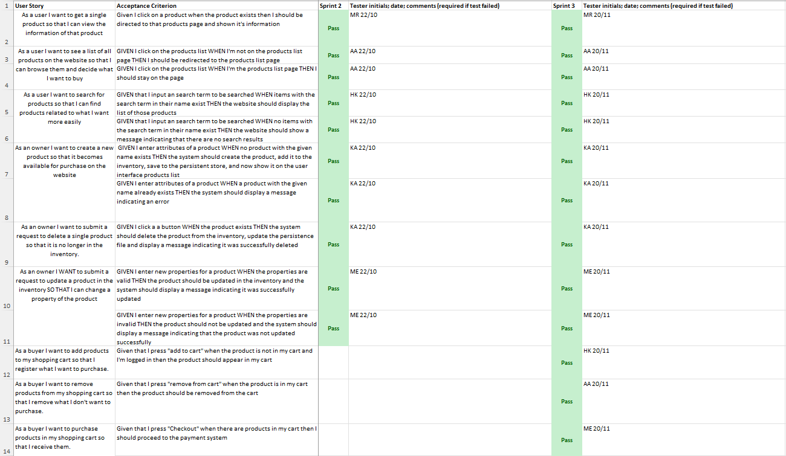
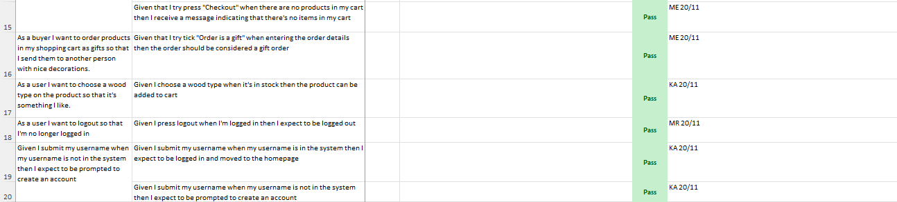

### Unit Testing and Code Coverage
All Unit Tests pass successfully.

Below is the Code Coverage for the whole program:

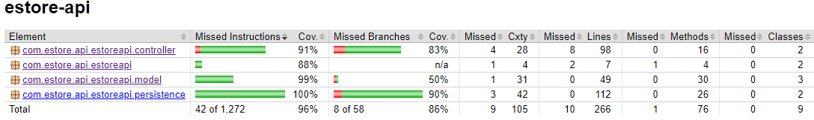

#### Controller
Both account and inventory controllers have the exact same code coverage found below:

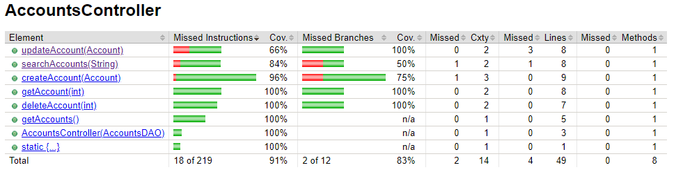

The missing branches are also the same, the first one being no tests for a search with no results:

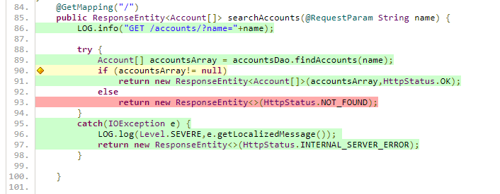

The second being if an exception is thrown while trying to update a product/account:

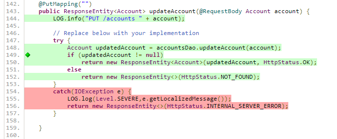

To improve the test coverage 
#### EstoreAPI
The code coverage for the EstoreApiApplication because we do not have a test for the main() method, which as far as we can tell is untestable since it just starts the application:

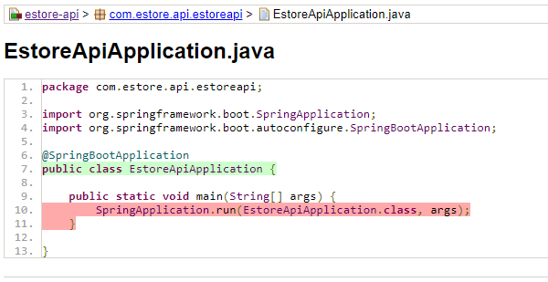

#### Model
The model tier has almost perfect code coverage:

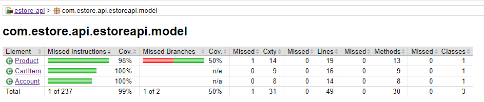

The only missing branch not being covered is for the inStock() method inside the Product class which returns true or false:

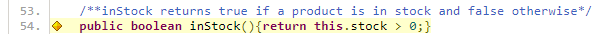

To improve the code coverage here we should add a test for checking that inStock() returns false when an item is out of stock.

#### Persistance
The persistance tier has perfect testing:

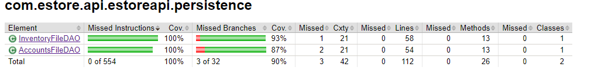

The untested branches are untestable since they are just single case scenarios (if condition is met do something, otherwise nothing), below is an example of this:

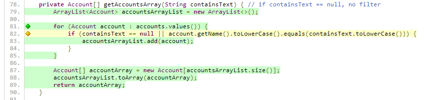

